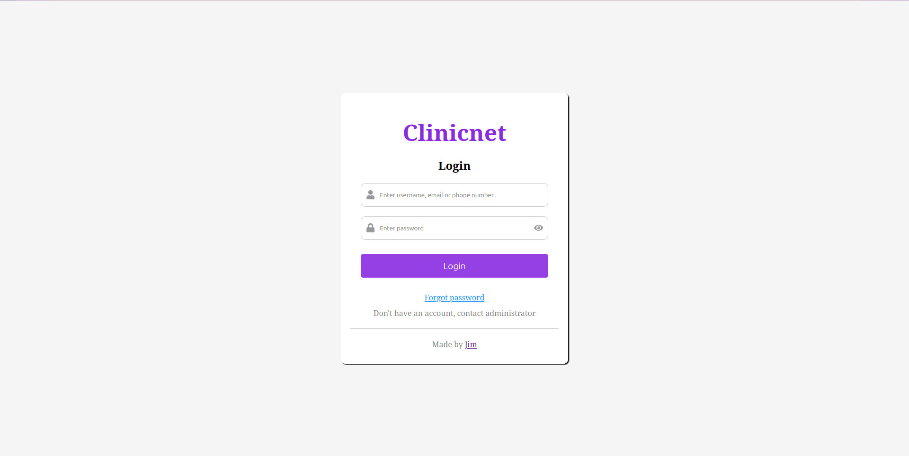
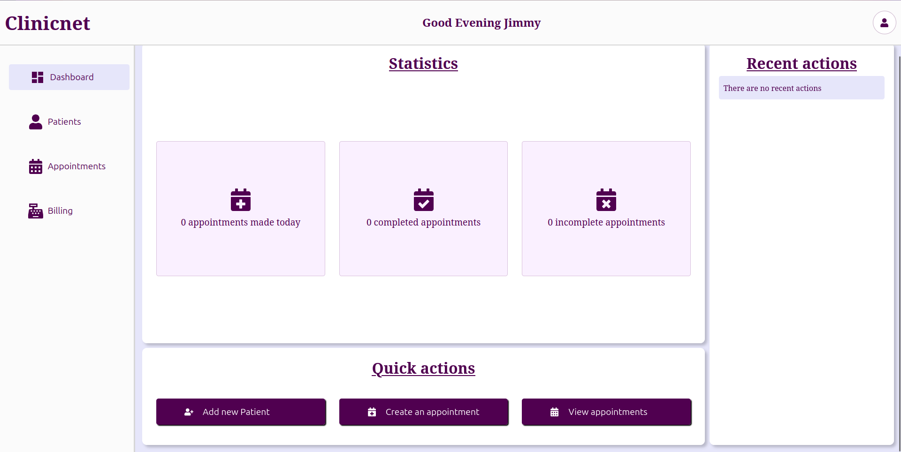
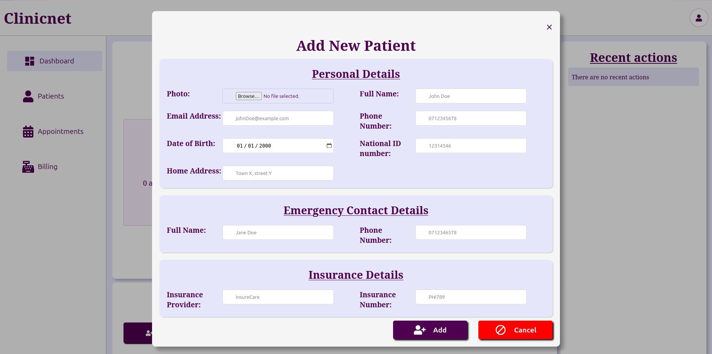
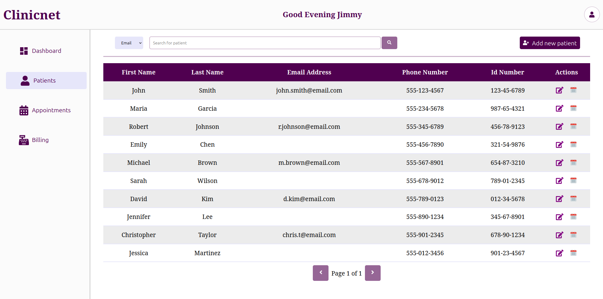
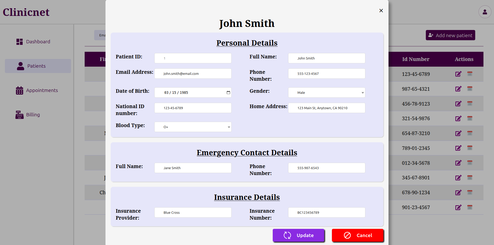

# Clinicnet

A clinic system that digitizes operations in a clinic making visits near 100% paperless

Live: [Local-Clinic](https://jims-local-clinic.vercel.app)

___


___

## Table of Contents

1. [Features](#features)
2. [Enhancements](#future-enhancements)
3. [Tech Stack](#tech-stack)
4. [Prerequisites](#prerequisites)
5. [Installation and Running](#installation-and-running)
6. [Usage](#usage)
   1. [Receptionist](#receptionist)
7. [Users](#users)
8. [Contributing](#contributing)
9. [Author](#author)

___

## Features

- Receptionist → Register patients, book appointments, billing
- Nurse/Technician → adding vitals and test results
- Doctor → View patients, record diagnoses, prescriptions
- Pharmacist → Manage medications, review prescriptions
- Manager → Staff CRUD, Generating reports, Review billings

## Future enhancements

- Implement JWT-based authentication
- Secure APIs with role based access
- Improving the UI
- Add file upload/download endpoints
- Unit testing

## Tech Stack

- **Backend:** Spring Boot(Java)
- **Frontend:** React(TS) + Vite
- **Database:** PostgresSQL
- **Containerization:** Docker, Docker compose

## Prerequisites

- [Docker](https://www.docker.com/) if using containerization
- [Maven](https://maven.apache.org/)
- [NPM](https://www.npmjs.com/)
- [PostgresSQL](https://www.postgresql.org/)

## Installation and Running

### 1. Clone this repository

```commandLine
git clone https://github.com/Jim-03/Local-Clinic.git
cd Local-Clinic
```

### 2. Create the database

Create a database named `clinic` in your PostgresSQL app

```sql
CREATE DATABASE clinic;
```

Grant all permissions to a user in the database

```sql
GRANT ALL PRIVILEGES ON DATABASE clinic to your_user;
```

### 3. Run the software

There are two options when running the software, **containerization** or **manual**

#### Option A: Containerized (recommended)
- Create a `.env` file at the project's root containing the following
```
DB_URL=jdbc:postgresql://db:5432/clinic
DB_USER=your_user
DB_NAME=clinic
DB_PASSWORD=your_password
SPRING_PROFILE=dev
VITE_API_URL=http://localhost:8080
APP_CORS_ALLOWED_ORIGINS=http://localhost:3000
```
> NOTE: To automatically create the database schema, use profile `dev` on `spring.profiles.active` otherwise switch to
`prod`
> The `dev` profile will reset the database on every launch
- Run the container
```
docker compose up --build
```

> NOTE: Some linux distributions may require running with `sudo` command

#### Option B: Individual Components

##### Frontend setup

- From the project's root directory move into the `/frontend` directory

```commandLine
cd /frontend
```

- Install the packages

```commandLine
npm install
```

- Create a `.env` file containing the following:

```
VITE_API_URL=http://localhost:8080
```

- Build the application

```commandLine
npm run build
```

- Serve the built app

```commandLine
npx serve -s dist -l 3000
```

##### Backend setup

From the project's root directory, move into the `/backend` directory

```commandLine 
cd /backend
```

Change the contents of `backend/src/main/resources/application.properties` to the following:

```properties
spring.application.name=clinic_system
spring.datasource.url=jdbc:postgresql://localhost:5432/clinic
spring.datasource.username=your_username
spring.datasource.password=your_password
spring.profiles.active=dev
app.cors.allowed-origin=http://localhost:3000/
```

> NOTE: To automatically create the database schema, use profile `dev` on `spring.profiles.active` otherwise switch to
`prod`
> The `dev` profile will reset the database on every launch

Run the command `mvn spring-boot:run` in the `/backend` directory to start the Spring Boot application
___
## Usage

On a successful startup, visit `http://localhost:3000` on your browser which will redirect to the login page below:

Enter one of the credentials from this [table](#users) 

### Receptionist

The receptionist has the following roles in the system:
- Adding new patients 
- Viewing existing patients 
- Updating existing patients 
- Booking/Cancelling appointments
- Handles billings and generating invoices

## Users
To be updated
___

## Contributing

1. Fork the repository.
2. Create your feature branch:
   ``` bash
   git checkout -b feature/YourFeature
   ```
3. Commit your changes:
   ```bash
   git commit -m 'Add some feature'
   ```
4. Push to the branch:
   ```bash
   git push origin feature/YourFeature
   ```
5. Open a pull request.

___

## License

This project is licensed under the MIT License. See the [LICENSE](LICENSE) file for more details.

___

## Author

**Name:** Jimmy Chemuku

### Contact

[GitHub](https://github.com/Jim-03) | [Email](mailto:chemuku.jimmy@gmail.com)
